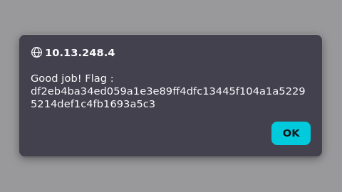
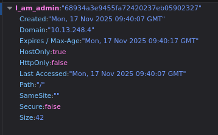

# Cookie Tampering (Broken Access Control)




## Description

La faille de Cookie Tampering (ou manipulation de cookie) se produit lorsque l’application stocke dans un cookie des informations critiques comme un rôle utilisateur, un statut d’authentification ou des permissions et qu'elle fait confiance à cette valeur fournie par le client.


## Comment reproduire la faille

1. Aller sur la page de Login: ```http://<IP_address>/?page=signin```

2. Ouvrir les DevTools du navigateur (onglet Application → Cookies).

3. Localiser le cookie **I_am_admin**



4. Constater qu’il est affiché en clair, qu’il utilise un hash MD5 simple, et qu’il est modifable par l’utilisateur:  
    68934a3e9455fa72420237eb05902327 -> la valeur à false

5. Modifier la valeur du cookie pour représenter un statut administrateur  
    b326b5062b2f0e69046810717534cb09 -> la valeur à true 

6. Refaire une tentative de connexion et constater que l’authentification est contournée:  
    l'application nous connecte sans connaitre les identifiants ni le mot de passe car maintenant nous sommes considérés comme un administrateur


## Recommandation pour empêcher la faille

* Ne jamais stocker un rôle ou un privilège dans un cookie:  
   La gestion des droits doit être faite côté serveur, jamais dans le navigateur

* Utiliser un identifiant de session sécurisé:  
   Le cookie doit contenir uniquement un identifiant de session opaque (ex. session_id), dont les données réelles (rôle, permissions) sont stockées sur le serveur

* Activer les protections de cookie:  
    HttpOnly = true → empêche l’accès depuis JavaScript  
    Secure = true → empêche la transmission hors HTTPS  
    SameSite = Strict → limite les attaques CSRF  

* Forcer l’usage de HTTPS

* Vérifications côté serveur:  
   Chaque action sensible doit vérifier le rôle réel de l’utilisateur

* Utiliser des mécanismes d’authentification robustes  
   Exemples :  
        - Sessions serveur  
        - JWT signés et non modifiables  
        - ACL gérées côté backend  


## Conclusion

Cette faille illustre un cas de Broken Access Control, dans lequel l’application confie au navigateur le soin d’indiquer les privilèges de l’utilisateur.
Comme le cookie n’est ni protégé ni validé, un attaquant peut facilement altérer sa valeur pour élever ses privilèges, ce qui compromet totalement la sécurité de l’application.

La solution est de déplacer tout contrôle d’accès côté serveur, d’utiliser des sessions sécurisées et de configurer correctement les cookies afin de garantir l'intégrité et la confidentialité des informations sensibles.