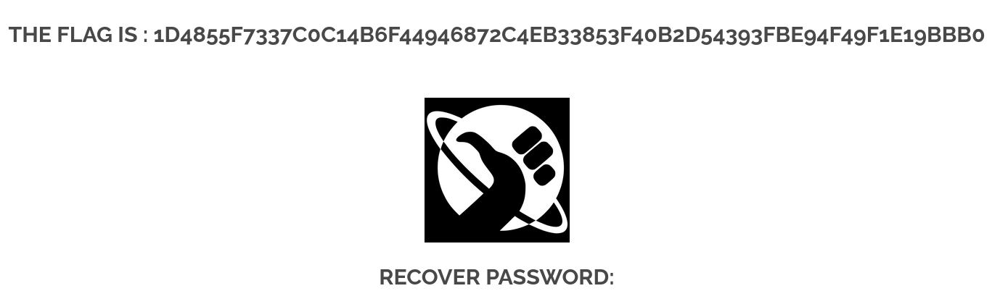

# Insecure Direct Object Reference (IDOR)

## Description

Une Insecure Direct Object Reference (IDOR) est une vulnérabilité où une application utilise des identifiants fournis par l'utilisateur (ex. : email, ID utilisateur, fichier, ressource) sans vérifier que l'utilisateur y est réellement autorisé.

## Comment reproduire la faille

1. Aller sur la page du mot de passe oublié ou `http://<IP_ADDRESS>/?page=recover`

2. Faire un inspect (F12) sur le bouton **SUBMIT**

3. Supprimer le maxlength via l’inspecteur du navigateur (F12)

4. Modifier l’adresse email via l’inspecteur du navigateur (F12) par `admin@borntosec.com`

5. Soumettre le formulaire

## Recommandation pour empêcher la faille

* Vérifier côté serveur que l’utilisateur demande bien la réinitialisation de son propre compte

* Ne jamais renvoyer un mot de passe en clair

* Mettre en place un workflow sécurisé de reset :
  * génération d’un jeton unique à usage unique
  * envoi d’un lien de réinitialisation valable quelques minutes
  * validation d’identité correcte

* Sanitiser et valider les entrées côté serveur (ne jamais se fier au HTML)

* Limiter les tentatives et enregistrer les demandes pour surveillance

## Conclusion

La vulnérabilité IDOR du formulaire de mot de passe oublié permet à un attaquant de modifier l’adresse email envoyée au serveur et d’obtenir directement le mot de passe d’un autre utilisateur.  
Cette faille résulte d’un manque total de contrôle d’accès et d’une mauvaise implémentation du mécanisme de réinitialisation de mot de passe.  
En appliquant une validation serveur stricte et en adoptant un processus sécurisé de reset, ce type de vulnérabilité peut être efficacement éliminé.