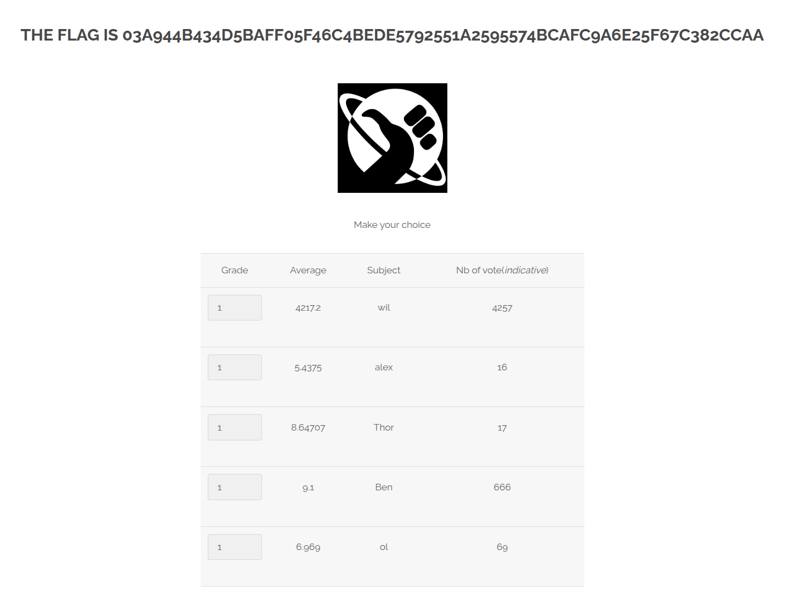

# Integer Input Validation



## Description

La faille Integer Input Validation apparaît lorsqu'une application ne valide pas correctement une entrée censée être un nombre entier.
Si l’entrée n’est pas filtrée ou convertie strictement en entier, un attaquant peut injecter une valeur inattendue (ex : chaîne de caractères, entier hors de la range attendue, etc).

## Comment reproduire la faille

1. Aller sur la page Survey ou `/?page=survey`

2. Ouvrir l'inspecteur web et se placer sur l'input concerné :
     ```
     <option value="1">1</option>
     ```

3. Changer la valeur et la value en un entier non autorisé (supérieur à 10) du type "54475" :
     ```
     <option value="54475">54475</option>
     ```

4. Puis sélectionner la nouvelle valeur modifiée dans le sélecteur

- Si la valeur modifiée est sélectionnable, la faille est confirmée.

## Recommandations pour empêcher la faille

* Valider strictement les entrées utilisateur :
     *Vérifier que la valeur est bien un entier (isnumeric(), ctype_digit, filtre backend…).

* Refuser toute chaîne contenant autre chose que 0-9.

* Forcer la conversion sécurisée :
     * Convertir via des fonctions qui lèvent une exception si l’entrée n’est pas valide.

* Utiliser des bornes :
     * Accepter uniquement un entier dans une plage définie (ex : entre 1 et 10).

* Sanitiser les entrées :
     * Ne jamais utiliser directement la valeur fournie sans contrôle préalable.

* Utiliser un WAF :
     * Peut bloquer les entrées anormales (ex : négatives, trop grandes, caractères interdits…).

## Conclusion

Cette faille Integer Input Validation est souvent sous-estimée, mais elle peut ouvrir la voie à des fuites de données ou à des crashs serveur, car l’envoi de valeurs inattendues (entiers négatifs, très grands nombres ou formats invalides) peut provoquer des erreurs internes, des débordements mémoire ou contourner la logique d’accès, révélant ainsi des informations sensibles ou surchargeant les ressources du serveur.
En appliquant une validation stricte des entrées, ou encore en imposant des bornes, il est possible de se prémunir efficacement contre ce type de vulnérabilité.