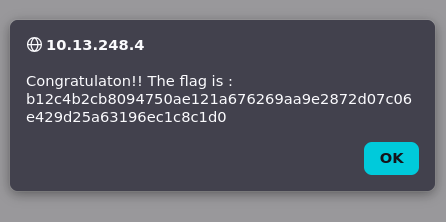

# Local File Inclusion (LFI)

## Description

Une vulnérabilité Local File Inclusion (LFI) permet à un attaquant d’inclure des fichiers locaux du serveur en manipulant un paramètre non sécurisé.  
En modifiant ce paramètre, il est possible d’accéder à des fichiers situés en dehors du dossier prévu.

## Comment reproduire la faille

1. partir d'une page utilisant `?page=` exemple `http://<IP_address>/?page=signin`

2. Remplacer les valeurs après `?page=` par `../../../../../../../etc/passwd` soit `http://<IP_address>/?page=../../../../../../../etc/passwd`

## Recommandation pour empêcher la faille

* Filtrer et valider les entrées utilisateur:  
  → Interdire les caractères ../, %2e%2e/, etc

* Utiliser une whitelist des fichiers autorisés à être chargés

* Ne jamais concaténer directement un paramètre à un chemin serveur

* Configurer le serveur pour limiter l’accès aux répertoires sensibles (chroot, permissions)

* Désactiver les inclusions dynamiques si non nécessaires

## Conclusion

Cette faille illustre un cas de Local File Inclusion, où l’application charge des fichiers en se fiant entièrement aux données fournies par l’utilisateur.
Comme le paramètre n’est ni filtré ni restreint, un attaquant peut manipuler le chemin pour accéder à des fichiers sensibles du serveur, compromettant ainsi la confidentialité et l’intégrité de l’application.

La solution consiste à valider strictement les chemins, appliquer une whitelist des fichiers autorisés et empêcher toute sortie de répertoire afin de garantir la sécurité du système.