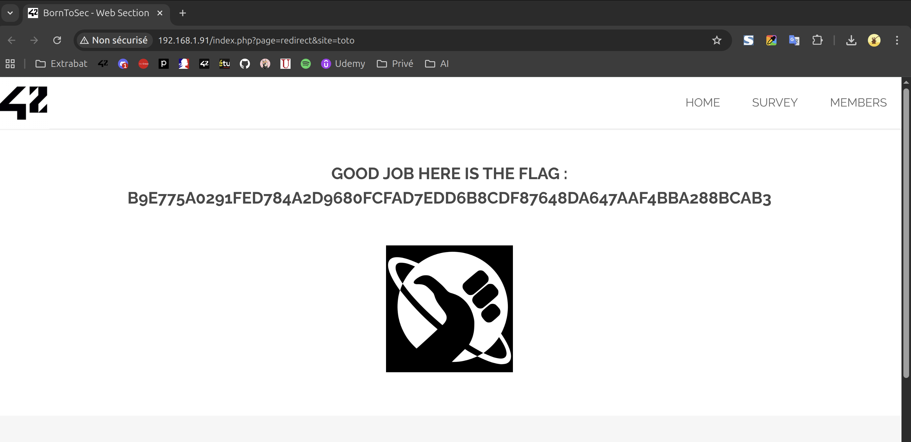

# Open Redirect



## Description

La faille Open Redirect apparaît lorsqu'une application web accepte des entrées non validées pour rediriger l’utilisateur vers une URL externe.
Si les paramètres de redirection ne sont pas strictement filtrés, un attaquant peut forcer la redirection vers un site malveillant, réaliser du phishing ou encore contourner des contrôles de sécurité.

## Comment reproduire la faille

1. Aller tout en bas de la page d'accueil les icônes de réseaux sociaux

2. Vérifier le mécanisme de redirection :
Les liens ne vont pas directement vers Facebook, Twitter ou Instagram mais utilisent un paramètre site dans la page interne redirect :
     ```
    <ul class="icons">
        <li><a href="index.php?page=redirect&site=facebook" class="icon fa-facebook"></a></li>
        <li><a href="index.php?page=redirect&site=twitter" class="icon fa-twitter"></a></li>
        <li><a href="index.php?page=redirect&site=instagram" class="icon fa-instagram"></a></li>
    </ul>
     ```

3. Tester un paramètre invalide pour déclencher la faille :
     ```
    <li><a href="index.php?page=redirect&site=toto"></a>
     ```

- Si le serveur renvoie le flag ou un comportement anormal, la faille est confirmée.

## Recommandations pour empêcher la faille

* Valider strictement les entrées utilisateur :
    * Créer une whitelist des sites autorisés
    * Rejeter toute valeur non prévue et renvoyer un code d’erreur 400 ou 404.

* Éviter les redirections contrôlées par l’utilisateur :
    * Préférer des liens directs vers les URL finales plutôt que de passer par une page de redirection.

* Vérifier le protocole et le domaine :
    * N’autoriser que http ou https et des domaines spécifiques.

## Conclusion

Cette faille Open Redirect peut sembler mineure, mais elle permet de réaliser du phishing, du vol de token, ou d’autres attaques de redirection vers des sites malveillants.
En appliquant une validation stricte des paramètres, une whitelist et une gestion correcte des erreurs, il est possible de se prémunir efficacement contre ce type de vulnérabilité.