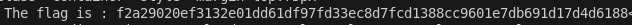

# Spoofing d’en-têtes HTTP




## Description

Le Spoofing d’en-têtes HTTP est une technique utilisée pour falsifier les informations envoyées dans les en-têtes d’une requête HTTP.  
Cette méthode permet de tromper un serveur en lui faisant croire que la requête provient d’une source légitime ou attendue, alors qu’elle est en réalité manipulée par un attaquant.


## Comment reproduire la faille

1. Aller sur la page BornToSec ou `http://<IP_ADRESS>/?page=b7e44c7a40c5f80139f0a50f3650fb2bd8d00b0d24667c4c2ca32c88e13b758f`

2. Faire une inspection (F12) sur la page et constater qu'il y a un commentaire avec des indications sensibles, ici: `Referer: https://www.nsa.gov/`, `User-Agent: ft_bornToSec`

3. Envoyer une requête avec les en-têtes falsifiés :
   - Utiliser `curl` pour envoyer une requête avec les en-têtes modifiés :
     ```bash
     curl -H "Referer: https://www.nsa.gov/" \
          -H "User-Agent: ft_bornToSec" \
          "http://<IP_ADRESS>/?page=b7e44c7a40c5f80139f0a50f3650fb2bd8d00b0d24667c4c2ca32c88e13b758f"
     ```

4. Observer la réponse pour trouver le flag 


## Recommandation pour empêcher la faille

* Ne pas se fier uniquement aux en-têtes HTTP car les en-têtes comme `Referer` ou `User-Agent` peuvent être facilement falsifiés. Ne pas les utiliser comme unique mécanisme de sécurité

* Utiliser des tokens d’authentification
   * Implémenter des **tokens CSRF** pour valider les requêtes
   * Utiliser des **sessions sécurisées** avec des cookies signés ou chiffrés

* Vérifier l’origine des requêtes côté serveur en validant l’IP source ou en utilisant des mécanismes comme **CORS** pour limiter les origines autorisées

* Appliquer le principe de défense en profondeur en combinant plusieurs couches de sécurité (ex : authentification, autorisation, validation des entrées)

* Journaliser et surveiller les requêtes suspectes


## Conclusion

Cette faille illustre un cas de spoofing d’en-têtes HTTP, où l’application se fie entièrement aux métadonnées fournies par le client pour autoriser ou refuser l’accès.
Comme les en-têtes ne sont ni vérifiés ni sécurisés côté serveur, un attaquant peut les falsifier pour contourner les restrictions et accéder à des ressources normalement protégées.  
La solution consiste à ne jamais faire confiance aux en-têtes HTTP, valider les requêtes côté serveur avec des mécanismes robustes (tokens, authentification) et appliquer une défense en profondeur pour garantir la sécurité de l’application.
