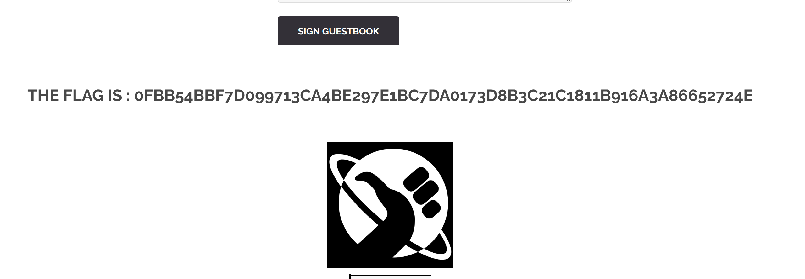

## Stored XSS via Feedback Form



## Description

La faille Stored XSS (Cross-Site Scripting persistant) sur le formulaire de Feedback se produit lorsqu’une application accepte et stocke du code malveillant injecté par un utilisateur dans la base de données.
Lorsque d’autres utilisateurs visitent la page contenant ce contenu, le code malveillant s’exécute automatiquement dans leur navigateur.

## Comment reproduire la faille

1. Aller sur la page Feedback ou `/?page=feedback`

2. Inspecter le formulaire et identifier les champs utilisateur :
     ```
    <input name="txtName" type="text" size="30" maxlength="10">
    <textarea name="mtxtMessage" cols="50" rows="3" maxlength="50"></textarea>
     ```

2. Injecter un script malveillant dans un des champs où le maxlenght a été modifié au préalable pour voir le type de filtration de sécurité appliquée:
     ```
    <script>alert("XSS")</script>
     ```
Les balises ne trigger pas le flag, pour obtenir le flag de ce challenge, il faut injecter simplement le mot clé détecté par le serveur, et même juste quelques lettres :
     ```
    script
     ```

- Cela signifie que la faille est confirmée et que le serveur dispose d’un système de détection par mots-clés qui vérifie la présence de termes liés au XSS dans les entrées utilisateur.

## Recommandations pour empêcher la faille

* Valider les entrées côté serveur :
    * Autoriser uniquement certains caractères (lettres, chiffres, ponctuation sûre) via une whitelist.

* Ne jamais se fier uniquement à la validation côté client (maxlength, JS).

* Limiter la longueur et les types d’entrée :
    * Vérifier la taille maximale et le type des champs texte avant de stocker.

* Utiliser un WAF :
    * Détecte et bloque automatiquement les tentatives d’injection XSS connues.

* Prévenir le spam et l’automatisation :
    * Limiter le nombre de soumissions par utilisateur/IP.

## Conclusion

Cette faille Stored XSS est critique car elle peut compromettre tous les visiteurs d’une page web, leur permettant d’exécuter du code malveillant à leur insu.
En appliquant une validation stricte des entrées, un encodage systématique des sorties, et des politiques de sécurité côté serveur, il est possible de se protéger efficacement contre ce type de vulnérabilité.