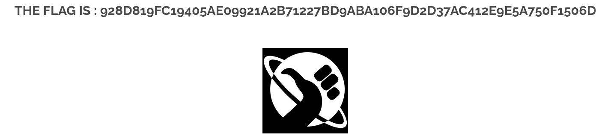

# XSS Reflected (Cross-Site Scripting Reflected)

## Description

Une XSS Reflected (Cross-Site Scripting Réfléchi) est une vulnérabilité où une application renvoie directement dans la page une donnée contrôlée par l’utilisateur sans l’assainir (sanitizing).   
L’attaquant peut alors injecter du contenu HTML ou JavaScript, qui sera exécuté par le navigateur de la victime.

## Comment reproduire la faille

1. Ouvrir l'image **nsa_prism** dans un nouvel onglet ou `http://<IP_address>/?page=media&src=nsa`

2. Définir un playload à injecter: ``

4. Encoder le en Base64: `PHNjcmlwdD5hbGVydCgxKTwvc2NyaXB0Pg==`

3. Modifier le paramètre `src` en y insérant une Data URL contenant le script JavaScript encodé en Base64 :  
`http://<IP_address>/?page=media&src=data:text/html;base64,PHNjcmlwdD5hbGVydCgxKTwvc2NyaXB0Pg==`

## Recommandation pour empêcher la faille

* Échapper systématiquement les entrées utilisateur avant de les afficher dans la page

* Bloquer les schémas dangereux comme `data:`, `javascript:` ou `vbscript:`

* Utiliser une **Content Security Policy (CSP)** restrictive empêchant le chargement de contenu non approuvé

* Valider le paramètre `src` afin qu’il ne puisse référencer que des ressources autorisées (ex. fichiers d’images)

* Ne jamais insérer directement des données non filtrées dans des attributs HTML sensibles

## Conclusion

Cette faille de type XSS Reflected est dangereuse, car elle permet à un attaquant d’exécuter un playload dans le navigateur de la victime, 
entraînant le vol de données, la modification de contenu ou la compromission de la session.  
En appliquant systématiquement des protections telles que l’échappement des entrées, la validation des paramètres et l’ajout d’une politique CSP adaptée, il est 
possible de prévenir efficacement ce type d’attaque.
